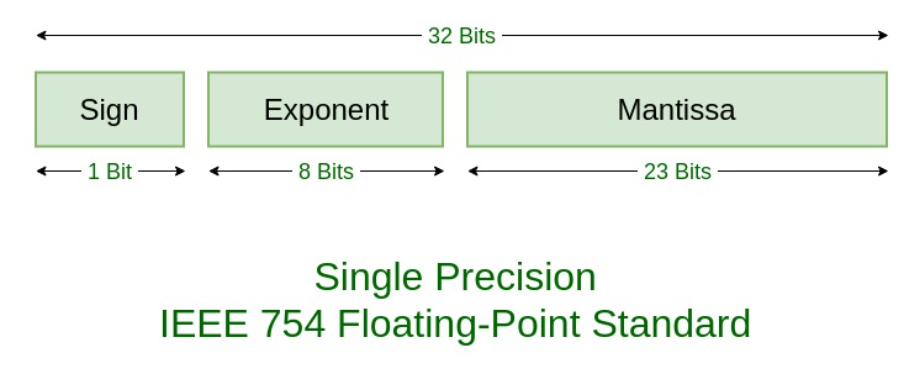

# Machine epsilon
Most real numbers cannot be represented exactly with floating-point numbers, and so for many purposes it is important to know the distance between two adjacent representable floating-point numbers, which is often known as [machine epsilon](https://en.wikipedia.org/wiki/Machine_epsilon).

Julia provides `eps`, which gives the distance between `1.0` and the next larger representable floating-point value:
```julia-repl
julia> eps(Float32)
1.1920929f-7

julia> eps(Float64)
2.220446049250313e-16

julia> eps() # same as eps(Float64)
2.220446049250313e-16
```
These values are `2.0^-23` and `2.0^-52` as `Float32` and `Float64` values, respectively. The `eps` function can also take a floating-point value as an argument, and gives the absolute difference between that value and the next representable floating point value. That is, `eps(x)` yields a value of the same type as `x` such that `x + eps(x)` is the next representable floating-point value larger than `x`:

```julia-repl
julia> eps(1.0)
2.220446049250313e-16

julia> eps(1000.)
1.1368683772161603e-13

julia> eps(1e-27)
1.793662034335766e-43

julia> eps(0.0)
5.0e-324
```
> The distance between two adjacent representable floating-point numbers is not constant, but is smaller for smaller values and larger for larger values.

>  In other words, the representable floating-point numbers are densest in the real number line near zero, and grow sparser exponentially as one moves farther away from zero. By definition, `eps(1.0)` is the same as `eps(Float64)` since `1.0` is a 64-bit floating-point value.

Julia also provides the `nextfloat` and `prevfloat` functions which return the next largest or smallest representable floating-point number to the argument respectively:

```julia-repl
julia> x = 1.25f0
1.25f0

julia> nextfloat(x)
1.2500001f0

julia> prevfloat(x)
1.2499999f0

julia> bitstring(prevfloat(x))
"00111111100111111111111111111111"

julia> bitstring(x)
"00111111101000000000000000000000"

julia> bitstring(nextfloat(x))
"00111111101000000000000000000001"
```

> This example highlights the general principle that the adjacent representable floating-point numbers also have adjacent binary integer representations.


Therefore, the above leads to many problems:

For example, when we add two numbers we need to ensure their in the same base. Thus, if the numbers are very far apart in terms of order then we need to 'drop' off many digits off the smaller number for the exponents that is the orders off the 2 numbers to match.

This also leads to `Round off Error`.

Thus issues with *roundoff error* come when one subtracts out the higher digits.
For example, $(x + \epsilon) - x$ should just be $\epsilon$ if there was no
roundoff error, but if $\epsilon$ is small then this kicks in. If $x = 1$
and $\epsilon$ is of size around $10^{-10}$, then $x+ \epsilon$ is correct for
10 digits, dropping off the smallest 6 due to error in the addition to $1$.
But when you subtract off $x$, you don't get those digits back, and thus you
only have 6 digits of $\epsilon$ correct.
```julia-repl
julia> ϵ = 1e-10rand()
julia> @show ϵ
ϵ = 1.1923160486570606e-12
1.1923160486570606e-12

julia> @show (1+ϵ)
1 + ϵ = 1.0000000000011924
1.0000000000011924
```
Notice that the few digits of $\epsilon$ have been dropped off while addition.

```julia-repl
julia> ϵ2 = (1+ϵ) - 1
1.1923795284474181e-12

julia> (ϵ - ϵ2)
-6.347979035750706e-17
```
Ideally, we should get 0 as the answer for the above calculation.However, that's not the case. Notice that we get the subtraction of the order of `-17`. Recall that the smallest number that can be represented is of the order of `-16`.


See how $\epsilon$ is only rebuilt at accuracy around $10^{-16}$ and thus we only
keep around 6 digits of accuracy when it's generated at the size of around $10^{-10}$!

>Thus, due to this Roundoff error that we have we can say that Floating point numbers are NOT associative  nor commutative under addition or subtraction.

Refer to the following for more information on [Loss of Significance](https://en.wikipedia.org/wiki/Loss_of_significance)

---

# Finite Differencing and Numerical Stability

To start understanding how to compute derivatives on a computer, we start with
*finite differencing*. For finite differencing, recall that the definition of
the derivative is:

$$f'(x) = \lim_{\epsilon \rightarrow 0} \frac{f(x+\epsilon)-f(x)}{\epsilon}$$
> Notice where the problem is. Recall what we did above. When we do $\epsilon 2$ = (1+$\epsilon$) - 1, the compiler cut off many digits off of $\epsilon$. Now , when we divide this value by $\epsilon$ again, we shift the number in terms of the power/order which means our error increases. So, we will get few good digits at first, but soon we would get only junk digits.

> One can build a random number generator from this :)
* Finite differencing directly follows from this definition by choosing a small
$\epsilon$.
* However, choosing a good $\epsilon$ is very difficult. 
* If $\epsilon$ is too large than there is error since this definition is asymtopic.
* However, if $\epsilon$ is too small, you receive roundoff error. 
* To understand why you would get roundoff error, recall that floating point error is relative, and can essentially store 16 digits of accuracy. 
* So let's say we choose $\epsilon = 10^{-6}$. Then $f(x+\epsilon) - f(x)$ is roughly the same in the first 6 digits, meaning that after the subtraction there is only 10 digits of
accuracy, and then dividing by $10^{-6}$ simply brings those 10 digits back up
to the correct relative size.


> This means that we want to choose $\epsilon$ small enough that the
$\mathcal{O}(\epsilon^2)$ error of the truncation is balanced by the $O(1/\epsilon)$
roundoff error. Under some minor assumptions, one can argue that the average
best point is $\sqrt(E)$, where E is machine epsilon

```julia-repl
julia> @show eps(Float64)
eps(Float64) = 2.220446049250313e-16
2.220446049250313e-16

julia> @show sqrt(eps(Float64))
sqrt(eps(Float64)) = 1.4901161193847656e-8
1.4901161193847656e-8

```
This means we should not expect better than 8 digits of accuracy, even when
things are good with finite differencing.


!! The above image uses `h` in place of $\epsilon$. That is, that while differentiating a function `f` we must do $\frac{f(x+h) - f(x)}{h}$ 
> Notice that in the above image we have the  optimum $\epsilon$ of the order $10^{-8}$ which is what we had calculated as the square root of the machine epsilon!!!

The centered difference formula is a little bit better, but this picture
suggests something much better...

# Differencing in a Different Dimension: Complex Step Differentiation

The problem with finite differencing is that we are mixing our really small
number with the really large number, and so when we do the subtract we lose
accuracy. Instead, we want to keep the small perturbation completely separate.

To see how to do this, assume that $x \in \mathbb{R}$ and assume that $f$ is
complex analytic. You want to calculate a real derivative, but **your function
just happens to also be complex analytic** when extended to the complex plane.
Thus it has a Taylor series, and let's see what happens when we expand out this
Taylor series purely in the complex direction:
(that is :- what we want to do is calculate $f \prime (x)$, where $x \in \mathbb{R}$ and $f : \mathbb{R} \rightarrow \mathbb{R}$.But, $f(x)$ is analytic(that is that its derivative exists in *some nice sense*) implying that's its Taylor series exists.)

$$f(x+ih) = f(x) + f'(x)ih + \mathcal{O}(h^2)$$

which we can re-arrange as:

$$if'(x) = \frac{f(x+ih) - f(x)}{h} + \mathcal{O}(h)$$

Since $x$ is real and $f$ is real-valued on the reals, $if'$ is purely imaginary.
So let's take the imaginary parts of both sides:

$$f'(x) = \frac{Im(f(x+ih))}{h} + \mathcal{O}(h)$$

since $Im(f(x)) = 0$ (since it's real valued!). Thus with a sufficiently small
choice of $h$, this is the *complex step differentiation* formula for calculating
the derivative.


> But to understand the computational advantage, recal that $x$ is pure real, and thus $x+ih$ is an imaginary number where **the $h$ never directly interacts with $x$** since a complex number is a two dimensional number where you keep the two pieces separate. Thus there is no numerical cancellation by using a small value of $h$, and thus, due to the relative precision of floating point numbers, both the real and imaginary parts will be computed to (approximately) 16 digits of accuracy for any choice of $h$.

# Derivatives as nilpotent sensitivities

The derivative measures the **sensitivity** of a function, i.e. how much the
function output changes when the input changes by a small amount $\epsilon$:

$$f(a + \epsilon) = f(a) + f'(a) \epsilon + o(\epsilon).$$

In the following we will ignore higher-order terms; **formally we set
$\epsilon^2 = 0$.** This form of analysis can be made rigorous through a form
of non-standard analysis called *Smooth Infinitesimal Analysis*, though
note that nilpotent infinitesimal requires *constructive logic*, and thus proof
by contradiction is not allowed in this logic due to a lack of the *law of the
excluded middle*.

A function $f$ will be represented by its value $f(a)$ and derivative $f'(a)$,
encoded as the coefficients of a degree-1 (Taylor) polynomial in $\epsilon$:

$$f \rightsquigarrow f(a) + \epsilon f'(a)$$

>Therefore this is a lot like a complex number  but here $\epsilon$ acts as a signifier just like complex $i$ does for coplex numbers.

Conversely, if we have such an expansion in $\epsilon$ for a given function $f$,
then we can identify the coefficient of $\epsilon$ as the derivative of $f$.

---

# Dual numbers

Thus, to extend the idea of complex step differentiation beyond complex analytic
functions, we define a new number type, the *dual number*. A dual number is a
multidimensional number where the sensitivity of the function is propagated
along the dual portion.

Here we will now start to use $\epsilon$ as a dimensional signifier, like $i$,
$j$, or $k$ for quaternion numbers. In order for this to work out, we need
to derive an appropriate algebra for our numbers. To do this, we will look
at Taylor series to make our algebra reconstruct differentiation.

Note that the chain rule has been explicitly encoded in the derivative part.

$$f(a + \epsilon) = f(a) + \epsilon f'(a)$$

to first order. If we have two functions

$$f \rightsquigarrow f(a) + \epsilon f'(a)$$
$$g \rightsquigarrow g(a) + \epsilon g'(a)$$

then we can manipulate these Taylor expansions to calculate combinations of
these functions as follows. Using the nilpotent algebra, we have that:

$$(f + g) = [f(a) + g(a)] + \epsilon[f'(a) + g'(a)]$$

$$(f \cdot g) = [f(a) \cdot g(a)]  + \epsilon[f(a) \cdot g'(a) + g(a) \cdot f'(a) ]$$
> Notice that the $f\prime(a) \cdot g\prime(a)\epsilon^{2}$ term is 0 since, we forced $\epsilon^{2}=0$.

From these we can *infer* the derivatives by taking the component of $\epsilon$.
These also tell us the way to implement these in the computer.

---

# Computer representation

Setup (not necessary from the REPL):

```julia
using InteractiveUtils  # only needed when using Weave
```

Each function requires two pieces of information and some particular "behavior",
so we store these in a `struct`. It's common to call this a "dual number":

```julia
struct Dual{T}
    val::T   # value
    der::T  # derivative
end
```

Each `Dual` object represents a function. We define arithmetic operations to
mirror performing those operations on the corresponding functions.

We must first import the operations from `Base`:

```julia
Base.:+(f::Dual, g::Dual) = Dual(f.val + g.val, f.der + g.der)
Base.:+(f::Dual, α::Number) = Dual(f.val + α, f.der)
Base.:+(α::Number, f::Dual) = f + α

#=
You can also write:
import Base: +
f::Dual + g::Dual = Dual(f.val + g.val, f.der + g.der)
=#

Base.:-(f::Dual, g::Dual) = Dual(f.val - g.val, f.der - g.der)

# Product Rule
Base.:*(f::Dual, g::Dual) = Dual(f.val*g.val, f.der*g.val + f.val*g.der)
Base.:*(α::Number, f::Dual) = Dual(f.val * α, f.der * α)
Base.:*(f::Dual, α::Number) = α * f

# Quotient Rule
Base.:/(f::Dual, g::Dual) = Dual(f.val/g.val, (f.der*g.val - f.val*g.der)/(g.val^2))
Base.:/(α::Number, f::Dual) = Dual(α/f.val, -α*f.der/f.val^2)
Base.:/(f::Dual, α::Number) = f * inv(α) # Dual(f.val/α, f.der * (1/α))

Base.:^(f::Dual, n::Integer) = Base.power_by_squaring(f, n)  # use repeated squaring for integer powers
```

We can now define `Dual`s and manipulate them:

```julia
f = Dual(3, 4)
g = Dual(5, 6)

f + g
```
The above gives `Dual(8, 10)` as the answer.
```julia
f * g
```
The above gives `Dual(15, 38)` as the answer.

```julia
f * (g + g)
```
The above gives `Dual(30, 76)` as the answer.

---

# Performance

It seems like we may have introduced significant computational overhead by
creating a new data structure, and associated methods. Let's see how the
performance is:

```julia
add(a1, a2, b1, b2) = (a1+b1, a2+b2)
```

```julia
add(1, 2, 3, 4)

using BenchmarkTools
a, b, c, d = 1, 2, 3, 4
@btime add($(Ref(a))[], $(Ref(b))[], $(Ref(c))[], $(Ref(d))[])
```
Benchmarking the above gives 1.799ns.
```julia
a = Dual(1, 2)
b = Dual(3, 4)

add(j1, j2) = j1 + j2
add(a, b)
@btime add($(Ref(a))[], $(Ref(b))[])
```
Benchmarking the above gives 1.399ns.

> Note that this is quite counter intuitive since we expected the Dual operatons to have some overhead due to the fact that thae compiler has to refer to multiple dispatches for addition, subtraction etc.. Now , we have **type stabilty** implying that at runtime the compiler knows exactly which function to perform.

It seems like we have lost *no* performance.
```julia
@code_native add(1, 2, 3, 4)
```

```julia
@code_native add(a, b)
```

We see that the data structure itself has disappeared, and we basically have a
standard Julia tuple.

---

# Defining Higher Order Primitives

We can also define functions of `Dual` objects, using the chain rule.
To speed up our derivative function, we can directly hardcode the derivative
of known functions which we call *primitives*. If `f` is
a `Dual` representing the function $f$, then `exp(f)` should be a `Dual`
representing the function $\exp \circ f$, i.e. with value $\exp(f(a))$ and
derivative $(\exp \circ f)'(a) = \exp(f(a)) \, f'(a)$:

```julia
import Base: exp
```

```julia
exp(f::Dual) = Dual(exp(f.val), exp(f.val) * f.der)
```

```julia
f
```

```julia
exp(f)
```
---
# Differentiating arbitrary functions

For functions where we don't have a rule, we can recursively do dual number
arithmetic within the function until we hit primitives where we know the derivative,
and then use the chain rule to propagate the information back up.
Under this algebra, we can represent $a + \epsilon$ as `Dual(a, 1)`.
Thus, applying `f` to `Dual(a, 1)` should give `Dual(f(a), f'(a))`. This is thus
a 2-dimensional number for calculating the derivative without floating point
error, **using the compiler to transform our equations into dual number arithmetic**.
To to differentiate an arbitrary function, we define a generic function and then
change the algebra.

```julia
h(x) = x^2 + 2
a = 3
xx = Dual(a, 1)
```

Now we simply evaluate the function `h` at the `Dual` number `xx`:

```julia
h(xx)
```

The first component of the resulting `Dual` is the value $h(a)$, and the
second component is the derivative, $h'(a)$!

We can codify this into a function as follows:

```julia
derivative(f, x) = f(Dual(x, one(x))).der
```

Here, `one` is the function that gives the value $1$ with the same type as
that of `x`.

Finally we can now calculate derivatives such as

```julia
derivative(x -> 3x^5 + 2, 2)
```

As a bigger example, we can take a pure Julia `sqrt` function and differentiate
it by changing the internal algebra:

```julia
function newtons(x)
   a = x
   for i in 1:300
       a = 0.5 * (a + x/a)
   end
   a
end
@show newtons(2.0)
@show (newtons(2.0+sqrt(eps())) - newtons(2.0))/ sqrt(eps())
newtons(Dual(2.0,1.0))
```
