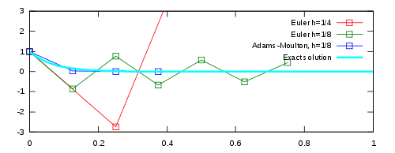

# Solving Stiff Ordinary Differential Equations

# [Stiffness of a differential equation](https://en.wikipedia.org/wiki/Stiff_equation)
In mathematics, a stiff equation is a differential equation for which certain numerical methods for solving the equation are numerically unstable, unless the step size is taken to be extremely small. It has proven difficult to formulate a precise definition of stiffness, but the main idea is that the equation includes some terms that can lead to rapid variation in the solution.

Let's see an example 
Consider the following initial value problem:
$$y\prime(t) = -15y(t), t >=0, y(0) = 1$$

The exact solution (shown in cyan) is
$$y(t) = e^{-15t}, y(t) \rightarrow 0 as t\rightarrow \infin $$
However we notice that the other methods deviate from the actual solution as the step size is quite large.(refer to the figure given below)
